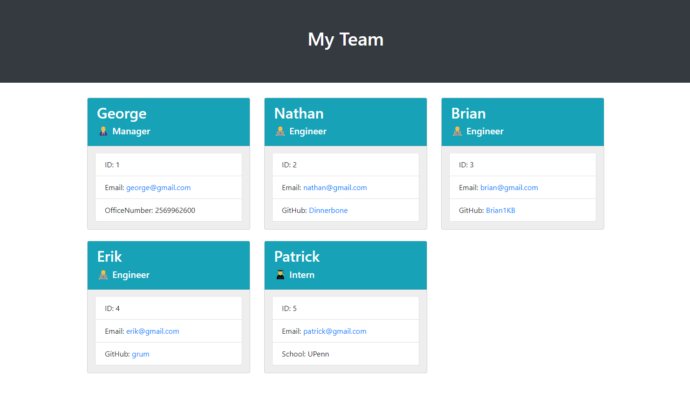

# Team Profile Generator
 
## Description 
This is a command-line application that takes in information about employees on a software engineering team, then generates an HTML webpage that displays summaries for each person. Users can quickly and easily create a HTML file of team profile.
## Usage
Users can run the command to start creating the README.md file: 
`node index.js`
## Screenshot
 

## Links

<a href="https://drive.google.com/file/d/1hq2ZCxr2WohiJeEDKAQs32LYJzwTRk2r/view?usp=sharing">Link to the walkthrough video</a>

<a href="https://github.com/Yanbud/team-profile-generator">Link to the code repository</a>

## License
This project is licensed under the MIT license.
